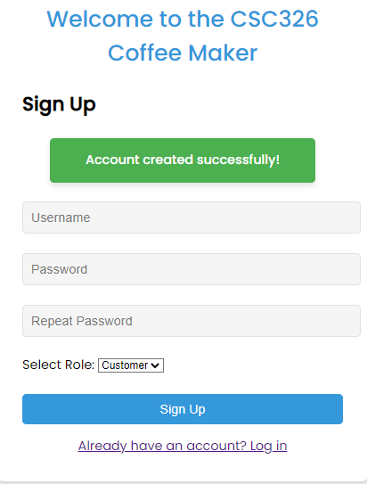
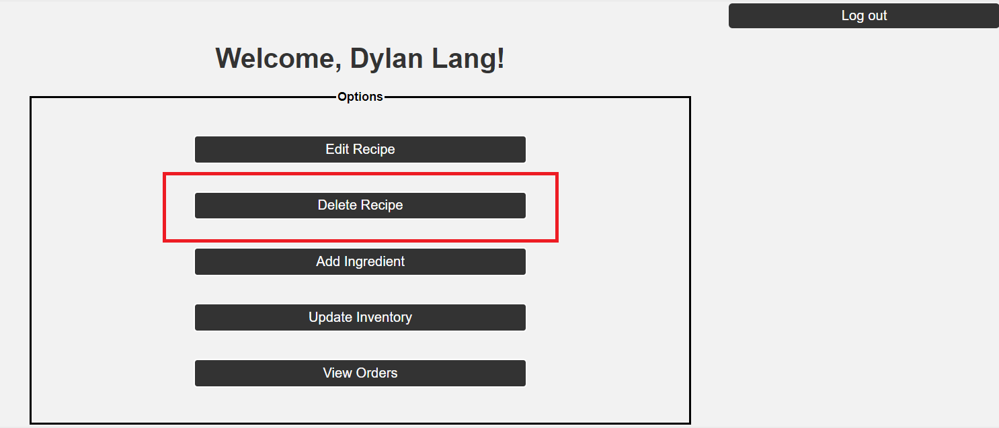
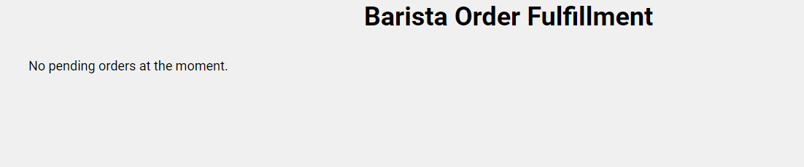

The Coffee Shop project is designed to simulate a coffee shop. It is a GrubHub lite esque application that allows for authentication & authorization, ordering coffee, fulfilling orders, viewing order history, adding ingredients, adding recipes, and viewing revenue earned.

# Design

### Tech Stack
The codebase is comprised of {{techStack}}.

# User Guide

## Sign up 
Upon starting the application you will be directed to the login page. However, before you can log in you will need to sign up with a user account in order to access the application. Click “Don’t have an account? Sign up” on the login form in order to view the sign up form.

* ### Successful Sign up

On the sign up form, you will need to provide a few essential pieces of information to register an account: _Username_, _Password_, and _Role_. For selecting a role, a user can select _Customer_, _Barista_, or _Manager _from the drop-down menu. Enter the required information in the sign up form and click the “Sign Up” button. Upon successful sign up you will see a message stating “Account Created Successfully”. 

* ### Unsuccessful Sign up: User already exists

After entering the required information to register a user account, if you see an error message stating "Error: User with username [your user] already exists." that means your username was not unique and in order to register an account, you must choose a username that has not been already taken by another person. Try again with a unique username since duplicate usernames cannot exist. 

* ### Unsuccessful Sign up: Username length

If you keep seeing an error message in red stating "Username must be between 6 and 25 characters." that means that the username you are entering currently does not meet the length requirements for a username. A username must be between 6 and 25 characters. Try again with an other username that meets the length requirements. 

* ### Unsuccessful Sign up: Password Length

If you keep seeing an error in red stating "Password must be between 8 and 25 characters." that means your password is not meeting the length requirements. A password must be between 8 and 25 characters. Try again with proper password that meets this length requirement. 

* ### Unsuccessful Sign up: Passwords Do Not Match

If you keep seeing an error message stating "Passwords do not match." that means the password you input in the _password_ field does not match the password you typed in the _Repeat Password_ field. Try typing the password again in both field and make sure the passwords match. 
 

* ### Unsuccessful Sign up: Multiple Managers

If you see an error message stating "Error: There can only be one manager user." that means you are trying to create another manager user while a manager already exists in the system. More than one admin cannot manage the system. Use the already created manager credentials. 

## Login
At this stage, the user guide assumes that you have successfully created a user account either as a _Customer_, Barista, or _Manager_. Click on the "Already have an account? Login" link on the sign up form after signing up for an account to be redirected to the login page. 

* ### Successful Login

On the login form, input your credentials: _Username_ and _Password_ and click the "Login" button. Upon successful login, you will be taken to your corresponding homepage depending on if you are a customer, barista, or manager. 

* ### Successful Login: Customer

Upon successful login a customer would be directed to the following page: 

* ### Successful Login: Barista

Upon successful login a barista would be directed to the following page: 

* ### Successful Login: Manager

Upon successful login a manager would be directed to the following page: 

* ### Successful Login: Guest

If a customer would like to anonymously place an order without signing up for an account, they can do so by clicking on "Continue as Guest" on the login form. Upon successfully logging in as a guest into the system you will see the following page as a guest user: 

* ### Unsuccessful Login: Incorrect Username or Password

If you see an error stating "Username or Password fields are incorrect." that means you are inputting the password or username incorrectly. Try again with the correct credentials. If the error persists, that means you have not registered an account yet. Please proceed to the sign up form and follow the instructions above to sign up for an account. 

## Manager
In this section, the user guide goes over the different functionalities a manager user has access to. 
Prerequisites: Sign up as a manager, and log in as a manager

* ### Add Ingredient
 
1. On the manager options page, click the "Add Ingredient" option.

2. In the _Name_ field, type the name of the ingredient you are wanting to add to the inventory. In the _Amount_ field, add the amount of the ingredient you want to add to the inventory.

3. Click the "Add Ingredient" button to add the ingredient to the inventory. If you receive the message stating "Success: Ingredient Added!" that indicates an ingredient has been added to the inventory successfully. 

4. Repeat 1-2 again to add more ingredients. 

Note: Negative ingredient or empty input fields are not valid thus the system will reject them. 

* ### Update Inventory

1. On the manager options page, click the "Update Inventory" option.

2. You can view the current inventory in the "View Inventory" view of the Update Inventory form

3. To update the inventory, add the new ingredient amount you want to add to the current inventory into the field that says "Enter Ingredient Quantity".

4. Click "Update Inventory" button. If you receive the message stating "Success: Inventory Added!" that indicates inventory has been updated successfully. The updated ingredient amounts will be shown in the "View Inventory" view. 

5. In order to only update one specific ingredient quantity and not all of them, you can enter zeros in all other fields. 

Note: Adding negative amounts is invalid thus the system will reject them

* ### Edit Recipe

1. On the manager options page, click the "Edit Recipe" option.

2. Select the desired Recipe you want to edit from the drop-down menu

3. The selected recipe will be populated with recipe details. Here you can edit any ingredient quantities or the price of the recipes as well as remove any ingredients or add additional ingredients to the recipe.  

4. Click the "Edit Recipe" button once desired edits have taken place. If you receive the message stating "Success: Recipe Edited!" that indicates that the system has successfully edited the recipe. 

Note: If you do not enter positive integers for price and ingredient quantities, the system will reject that invalid request. You also can not edit the recipe and remove all the ingredients from the recipe as the system will also reject this invalid request. A recipe cannot contain duplicate ingredients either.  

* ### Delete Recipe
1. On the manager options page, click the "Delete Recipe" option.

2. Select the desired recipe you want to delete from the system or select the "Delete all recipes?" option to delete all recipes from the system. 

3. Click the "Delete" button. If you receive a message stating "Recipe deleted successfully" that indicates that you have deleted the desired recipe from the system.

* ### View Orders
1. On the manager options page, click the "View Orders" option

2. Here you can view all orders that have taken place in the system, along with all the necessary information associated with each order for managerial purposes. 

3. You can also view the total revenue that has been generated through all the orders in the system. Revenue only starts to count when an order's status changes to _READYFORPICKUP_. 

4. To provide easy order history management, you can filter orders by status, price, and date.

## Barista
In this section, the user guide goes over the different functionalities a barista user has access to. 
Prerequisites: Sign up as a barista, and log in as a barista

* ### Add a Recipe

1. On the barista options page, click the "Add a Recipe" option.

2. In the input fields, enter the name of the recipe, the price of the recipe, and select the ingredients by clicking on the desired ingredient and entering the quantity of the ingredients. 

3. If you wish to remove any ingredients from the recipe, click the X button. 

4. To add the recipe to the system, click the "Create Recipe" button. If you receive a message stating "Success: Recipe Created" that indicates that your recipe was successfully added to the system. 

Note: If you do not enter a positive integer for the ingredient quantity or price of the recipe, the system will reject that request because that is an invalid request. A recipe cannot contain duplicate ingredients either. 

* ### Fulfill Orders
1. On the barista options page, click the "Fulfill Orders" option.

2. If there are pending orders for customers, you will see the order number for it and the menu items customer ordered. 

3. To fulfill the order click the "Fulfill Order" button. If you see a message stating "Order Fulfilled Successfully!" that indicates the customer's order has been fulfilled. 

4. If you see an error message, that means orders cannot be fulfilled because the inventory to make the recipe is low and the customer order is rejected. 

5. If you see a message stating "No pending orders at the moment." on the _Barista Order Fulfillment_ view that means you have no orders to process yet.
 

## Customer
In this section, the user guide goes over the different functionalities a customer user has access to. 
Prerequisites: Sign up as a customer, and log in as a customer

* ### Place Order
1. On the customer options page, click the "Place Order" option. 

2. The menu shows available menu items along their prices and the ingredients in the recipe. 

3. Select the desired recipe you want to order from the menu and click "Add to Order". 

4. The recipe you selected will be populated with information like the price in the cart panel. Enter the quantity of the menu item to indicate how many you will like to add to your order or remove the item if not wanted anymore by clicking the "Remove" button. 

5. To checkout, input the payment amount in the _Payment_ field and click the "Checkout" button. 

6. A message indicating order confirmation will pop-up and show you your change due. 

Note: All quantities must be positive integers and duplicate menu items cannot be added to the system otherwise, the system will reject an invalid request. In order for the system, to accept the payment, the payment amount must be greater than or equal to the amount owed.
* ### Order History 

1. On the customer options page, click the "Order History" option. 

Then, you will be shown the following screen where "awaleed" is the customer's username:

2. In the _Order History_ view, you are able to view your order histories from the past including the most recent order just placed. You can view your order number, status, order details, price, the amount paid, time stamp, and the current status of your order. Before an order is made, the status will remain _Pending_. 

3. Once the order is ready (when fulfilled by a barista), the status will change to _READYFORPICKUP_.

4. To pick up the order, click on the pickup button in a _READYFORPICKUP_ order like the first one above, and the order status will change to _PICKEDUP_.

5. If an order status changes to _REJECTED_, that indicates the barista was not able to fulfill your order due to low inventory.

Note: Customers can filter orders by status, price, and by date for easy management and access to their order history

## Guest
* ### Place Order
1. On the guest options page, click the "Place Order" option. 

2. The menu shows available menu items along their prices and the ingredients in the recipe. 

3. Select the desired recipe you want to order from the menu and click "Add to Order". 

4. The recipe you selected will be populated with information like the price in the cart panel. Enter the quantity of the menu item to indicate how many you will like to add to your order or remove the item if not wanted anymore by clicking the "Remove" button. 

5. To checkout, input the payment amount in the _Payment_ field and click the "Checkout" button. 

6. A message indicating order confirmation will pop-up and show you your change due. 

Note: All quantities must be positive integers and duplicate menu items cannot be added to the system otherwise, the system will reject an invalid request. In order for the system, to accept the payment, the payment amount must be greater than or equal to the amount owed. It is also important to note that Guest users do not have access to order histories for privacy purposes. That is a perk only available to registered users. 